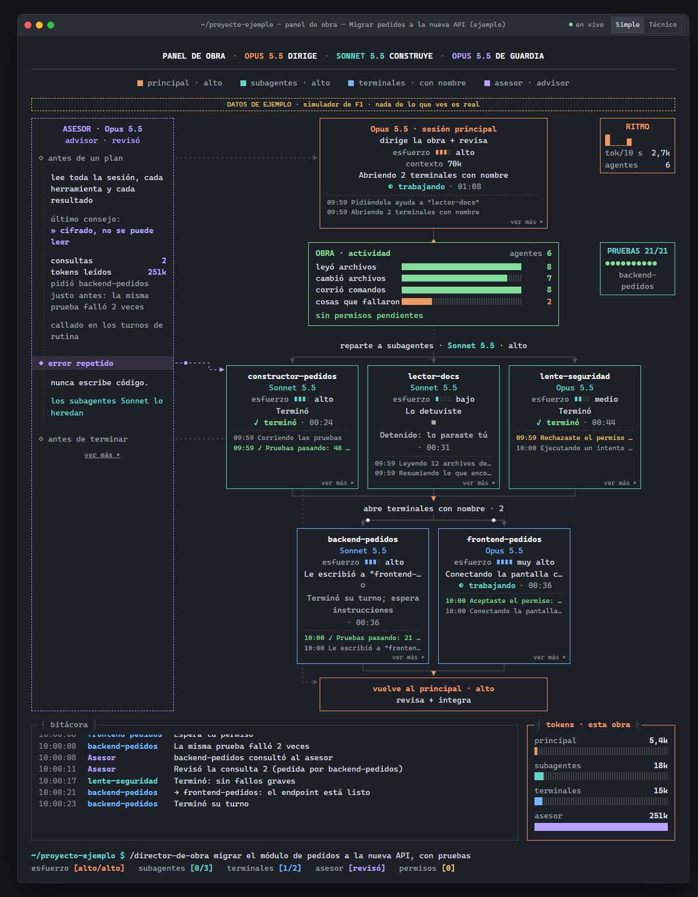
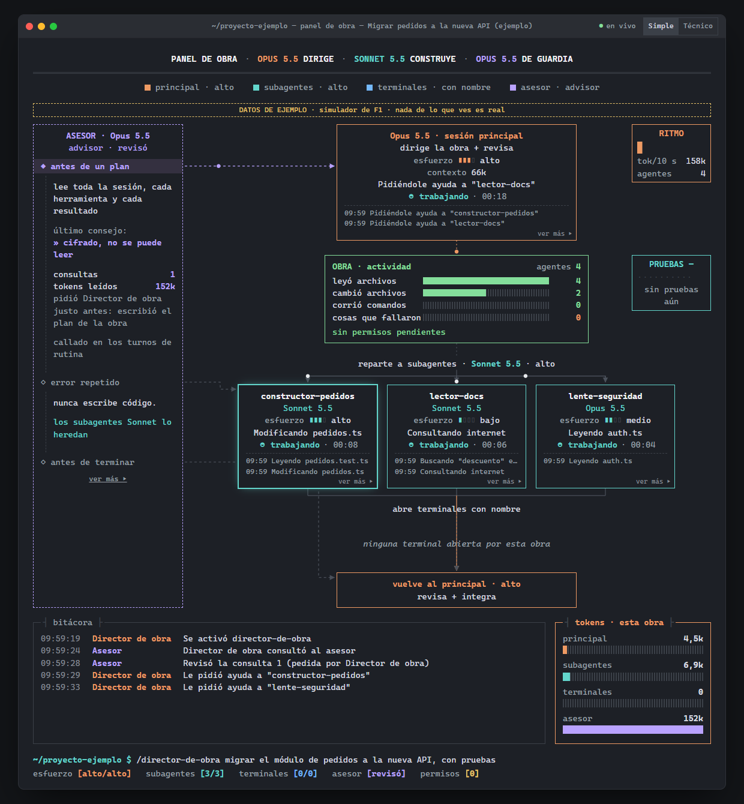
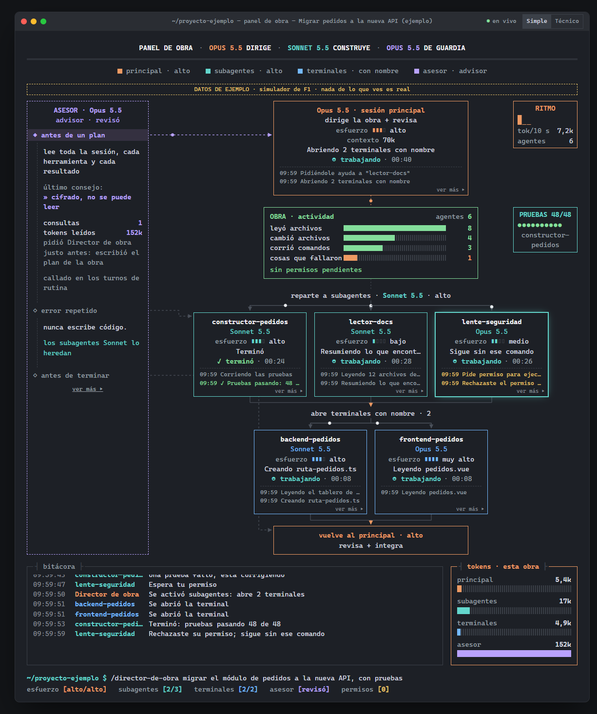
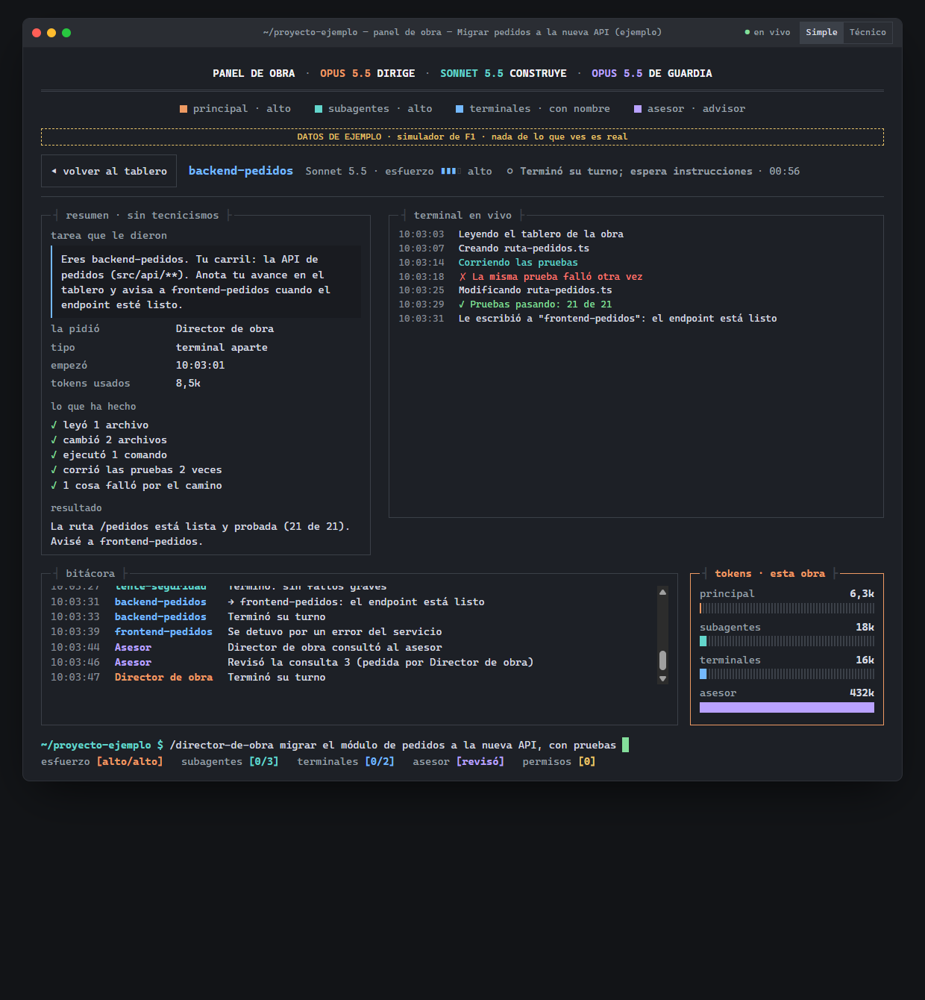
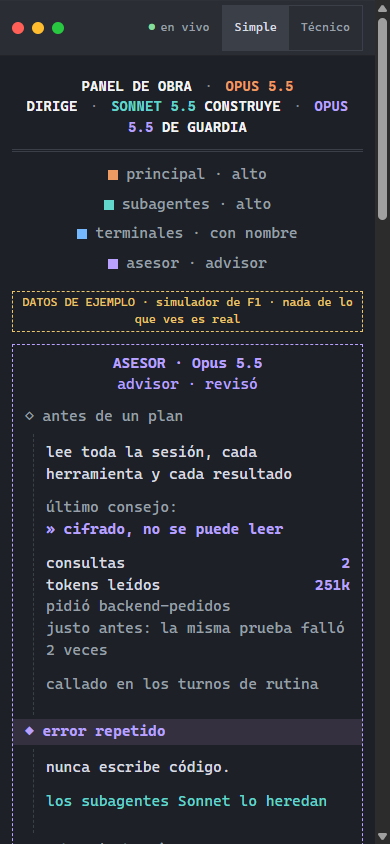
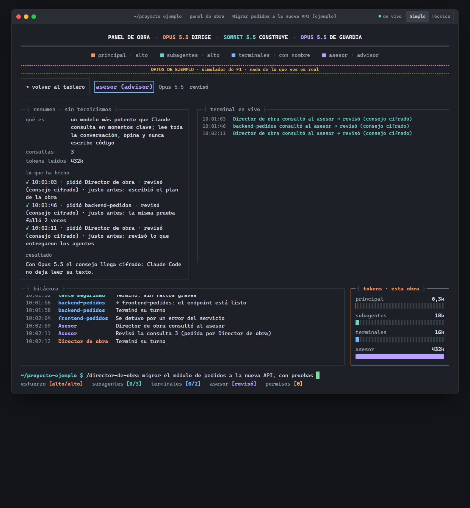
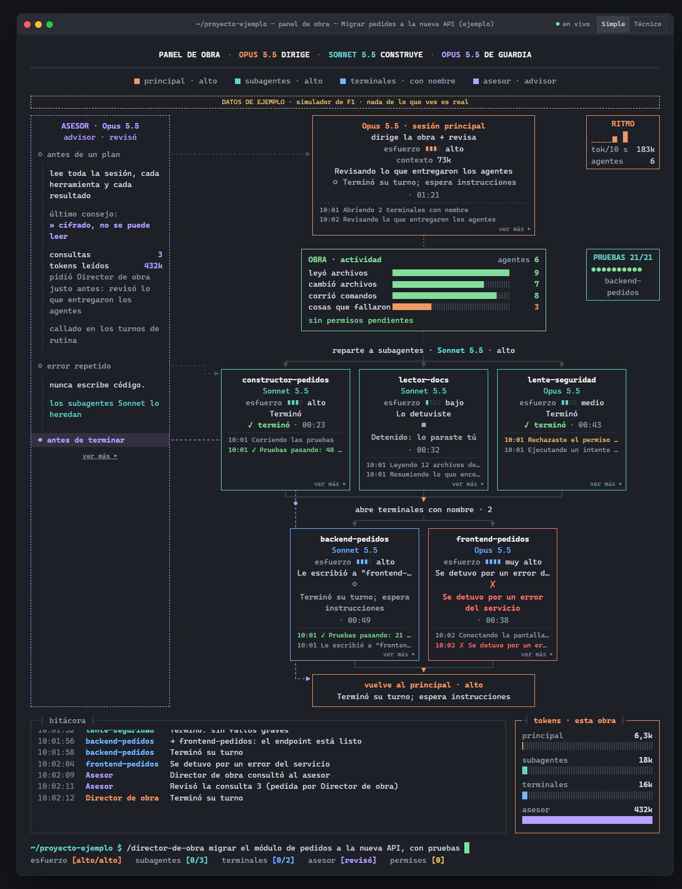

# Panel de Obra

**Monitor local, en vivo y en lenguaje simple, de los agentes de Claude Code.**

Es un plugin para Claude Code que abre sola una página en tu navegador cuando empieza una «obra», es decir, un trabajo repartido entre varios agentes. Muestra en tiempo real qué hace cada uno:

- qué modelo y qué esfuerzo usa;
- en qué estado está y cuánto tiempo lleva;
- su propia mini-terminal;
- cuánto gasta;
- cuándo consulta al asesor (*advisor*).

Todo funciona en tu equipo: escucha solo en `127.0.0.1`, no usa internet y no gasta tokens.



> Las capturas usan el simulador incluido (`herramientas/simulador.mjs`) con **datos de ejemplo**.

---

## Por qué existe

Cuando una tarea se reparte entre varios agentes la actividad queda dispersa. Una sesión principal, subagentes en segundo plano y terminales aparte con su propio nombre escriben, cada uno, en su ventana y en jerga técnica. El Panel de Obra junta todo en una sola página que se entiende sin saber programar: «Leyendo pedidos.ts», «Corriendo las pruebas», «Espera tu permiso para instalar una librería».

El diseño visual se inspira en una animación de un árbol de agentes publicada en X (Opus planifica, Sonnet construye y un asesor vigila), adaptada a datos reales.

## El flujo, en capturas

| | |
|---|---|
| **1. Empieza la obra.** Al activar la skill que dirige el trabajo, la página se abre sola. El asesor revisa el plan antes de repartirlo.  | **2. Trabajan los subagentes.** Cada caja muestra modelo, esfuerzo, qué hace ahora y sus últimas acciones. Un permiso rechazado queda anotado.  |
| **3. Terminales con nombre.** Las sesiones aparte (`claude --name …`) aparecen como una segunda rama. El asesor marca el momento en que lo consultaron.  | **4. «Ver más».** Un agente por dentro: la tarea que le dieron, quién la pidió, lo que ha hecho, el resultado y su terminal en vivo.  |
| **5. En el teléfono.** Todo pasa a una sola columna.  | **6. El asesor.** Cuántas consultas hubo, quién las pidió, qué pasó justo antes y cuántos tokens leyó.  |
| **7. Fin de la obra.** Estados finales: terminó, detenido, falló por un error del servicio, espera instrucciones.  | |

**Estados de una caja:**

| Símbolo | Estado |
|---|---|
| ◐◓◑◒ | trabajando |
| ◆ | espera tu permiso |
| ✓ | terminó |
| ✗ | falló |
| ■ | detenido |
| ○ | esperando instrucciones |

El color nunca es la única señal.

## Cómo funciona

```
Claude Code (app de escritorio · terminal · VS Code)
 └─ hooks del plugin (pocos y asíncronos; nunca imprimen ni bloquean)
      SessionStart · UserPromptExpansion · PreToolUse(Skill|Agent|Task|Workflow)
      SubagentStart/Stop · PermissionRequest/Denied · Notification · Stop · StopFailure · SessionEnd
          │  aviso firmado con HMAC, entregado por un proceso aparte (sin retrasar a Claude)
          ▼
 servidor local (Node, sin dependencias, 127.0.0.1)
   ├─ «obras»: se abren cuando se activa una de las skills configuradas
   ├─ lee los transcripts que Claude Code ya escribe, solo los de la obra y solo lo nuevo
   │    → actividad, modelo, esfuerzo, tokens (sin duplicar), asesor, cierres
   └─ página en vivo (SSE) con enlace de un solo uso y cookie HttpOnly
          ▼
 navegador: tablero + «Ver más» (HTML/CSS/JS locales, CSP estricta)
```

- **Los hooks** dan lo instantáneo: que nace un agente, que pide permiso, que termina.
- **Los transcripts** dan lo que queda escrito: qué hizo, con qué modelo y cuánto gastó.
- **Lo que no se puede saber dice «desconocido»:** el panel nunca inventa un dato.

## Requisitos

- **Claude Code**, en la app de escritorio, la terminal o VS Code.
- **Node.js 20 o superior.**
- **Windows**, que es donde está probado. macOS, Linux y WSL están contemplados en el código, pero sin probar.

## Instalación

```bash
git clone https://github.com/tormentionrex-hub/panel-de-obra.git
cd panel-de-obra
node herramientas/instalar.mjs --registrar
```

El instalador hace cuatro cosas:
- Comprueba que haya un Node estable.
- Genera los hooks con su ruta absoluta.
- Crea `~/.claude/panel-agentes/` con un secreto que solo tu usuario puede leer.
- Registra la carpeta como marketplace local e instala el plugin `panel-agentes`.

Antes de tocar tu `~/.claude/settings.json` hace una copia de seguridad, y al terminar muestra exactamente qué cambió: solo `enabledPlugins` y `extraKnownMarketplaces`.

## Uso

- **No hay que hacer nada.** Al abrir Claude Code el servidor se levanta solo. Cuando una de las skills configuradas empieza a trabajar, la página se abre sola (una vez por obra y solo si no hay ya una pestaña abierta).
- **Para abrirla a mano:** `/panel` dentro de Claude Code, o `herramientas/abrir-panel.cmd`.
- **Simple / Técnico:** «Leyendo pedidos.ts» frente a `Read src/pedidos.ts`.

### Qué skills activan una obra

Por defecto son `director-de-obra`, `subagentes` y `escalera-de-ejecucion`, las skills de orquestación del autor. Puedes añadir las tuyas en `~/.claude/panel-agentes/config.json`:

```json
{ "skillsExtra": ["mi-skill-de-equipo"], "autoabrir": true }
```

Si quieres que se detecten también cuando las escribes con `/`, añádelas además al filtro `UserPromptExpansion` de `plugin/hooks/hooks.json` antes de instalar. Cuando Claude las invoca por su cuenta (herramienta `Skill`) se detectan siempre.

## Apagar y desinstalar

| Quiero… | Cómo |
|---|---|
| Apagarlo un rato | Crea un archivo vacío `~/.claude/panel-agentes/apagado` (bórralo para encenderlo), o define `AGENT_PANEL=off` |
| Desactivar el plugin | `claude plugin disable panel-agentes@panel-agentes-local` |
| Desinstalar todo | `node herramientas/desinstalar.mjs`: revierte el asesor, quita el plugin y su copia y borra los datos |

## El asesor (opcional)

`herramientas/asesor.mjs diff | on | off | estado` aplica un cambio a las skills del autor, siempre con copia de seguridad:

- en las terminales que trabajan con **Sonnet**, pone `--advisor opus`;
- añade una regla de cuándo consultar al asesor: antes de un plan grande, cuando un error se repite y antes de dar algo por terminado.

**El texto del consejo no se puede leer:** con los asesores actuales llega cifrado. El panel muestra la consulta, quién la pidió, el resultado y los tokens del asesor.

## Seguridad y privacidad

- **Solo `127.0.0.1`:** valida `Host` (frente al *DNS rebinding*), rechaza peticiones con `Origin` o de otros sitios (`Sec-Fetch-Site`) y no tiene CORS.
- **Avisos firmados:** cada aviso de los hooks va firmado con HMAC-SHA256 y lleva su hora; se descartan los viejos y los duplicados.
- **Página protegida:**
  - se abre con un enlace de un solo uso que deja una cookie `HttpOnly; SameSite=Strict`;
  - CSP estricta (`script-src 'self'`, `frame-ancestors 'none'`, `require-trusted-types-for 'script'`);
  - todo texto se pinta con `textContent`, nunca como HTML.
- **Secretos y texto:** se redactan claves y tokens (`sk-ant-…`, `ghp_…`, `*_KEY=`, JWT, `Authorization`, cadenas de alta entropía) antes de guardar o mostrar nada, y se quitan los códigos ANSI/OSC y bidi.
- **Archivos:** solo se leen transcripts dentro de `~/.claude/projects`.
- **Topes:** tamaño de cada aviso, eventos por segundo y líneas por agente.
- **Sin historial en disco:** el estado vive en memoria. En disco solo quedan marcas pequeñas de las obras activas y un registro de diagnóstico sin contenido.

## Pruebas

```bash
node --test pruebas/unidades.test.mjs pruebas/episodios.test.mjs pruebas/seguridad.test.mjs
```

Son 30 pruebas: redacción, lenguaje simple, estados, tokens sin duplicar, permisos, rutas permitidas y seguridad del servidor (firma, `Host`, `Origin`, cookie, CSP, límites). Dos pruebas usan datos reales capturados en el equipo del autor y se omiten si no están.

El diseño se puede ver sin Claude Code:

```bash
node herramientas/simulador.mjs --abrir
```

## Estructura

```
plugin/
  .claude-plugin/plugin.json   manifiesto del plugin
  hooks/hooks.json             hooks (lo genera el instalador)
  bin/                         reenviar.mjs (hook) · abrir.mjs (/panel) · comun.mjs
  commands/panel.md            comando /panel
  servidor/                    servidor · episodios (estado) · transcripts · intérprete · redacción
  web/                         index.html · panel.css · panel.js
herramientas/                  instalar · desinstalar · asesor · simulador · abrir-panel.cmd
pruebas/                       pruebas con node:test
docs/                          hallazgos del experimento F0b y capturas
GUIA.md                        guía de uso detallada
```

## Limitaciones conocidas

- **Formato de los transcripts:** no está documentado por Anthropic. Si cambia, lo que depende de él (tokens, modelo confirmado, actividad) pasa a «desconocido», y los estados que dan los hooks siguen funcionando.
- **Retraso en la terminal:** en `claude -p`, Claude Code escribe el registro del agente principal en tandas, así que se ve con retraso. En la app de escritorio es inmediato.
- **Terminales hijas:** se reconocen por el nombre que anuncia la obra (`claude --name X`).
- **Sin probar:** macOS y WSL.
